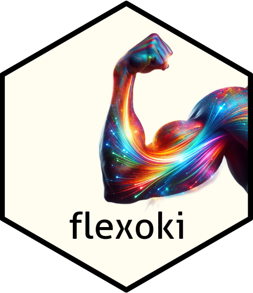

<!-- README.md is generated from README.Rmd. Please edit that file -->

# flexoki 

This is a color palette for R based on Steph Ango’s “inky color scheme”
[flexoki](https://stephango.com/flexoki). According to Steph,

> Flexoki is designed for reading and writing on digital screens. It is
> inspired by analog inks and warm shades of paper… Flexoki is
> minimalistic and high-contrast. The colors are calibrated for
> legibility and perceptual balance across devices and when switching
> between light and dark modes.

## Installation

You can install the development version of flexoki from
[GitHub](https://github.com/) with:

``` r
# install.packages("pak")
pak::pak("mdscheuerell/flexoki")
```

## Color options

flexoki offers the following options for colors:

- an off-white “paper” background (`#FFFCF0`)

- black (`#100F0F`)

- 12-level gray-scale

- 12-levels of saturation for 8 different hues

The following image shows the different hues and levels of saturation
available in flexoki.[^1] See [Examples](#examples) below for
information on how to use flexoki.

<figure>

<figcaption aria-hidden="true">Colors/hues available in the flexoki
package.</figcaption>
</figure>

<br>

## Examples

At present there is only one function in flexoki: `flex()`.

``` r
flex(col, sat = 400, code = "hex", palette = flexoki)
```

`flex()` is designed to work with scalar or vector inputs and can
provide color codes in either hexadecimal (default) or RGB formats.

``` r
library(flexoki)

## two different colors with same saturation levels
flex(c("blue", "red"), 100)
#> [1] "#C6DDE8" "#FFCABB"

## two different colors with same saturation levels in RGB
flex(c("blue", "red"), 100, code = "rgb")
#> # A tibble: 2 × 3
#>     red green  blue
#>   <int> <int> <int>
#> 1   198   221   232
#> 2   255   202   187

## gray with different saturation levels
flex("gray", c(100, 200)) # same as flex("base", c(100, 200))
#> [1] "#E6E4D9" "#CECDC3"

## three colors with specific saturation levels
flex(c("blue", "red", "green"), c(100, 200, 300))
#> [1] "#C6DDE8" "#F89A8A" "#A0AF54"
```

[^1]: Graphic courtesy of [Steph Ango’s
    website](https://stephango.com/flexoki) and available
    [here](https://github.com/kepano/flexoki/blob/main/_images/flexoki-palette.png).
